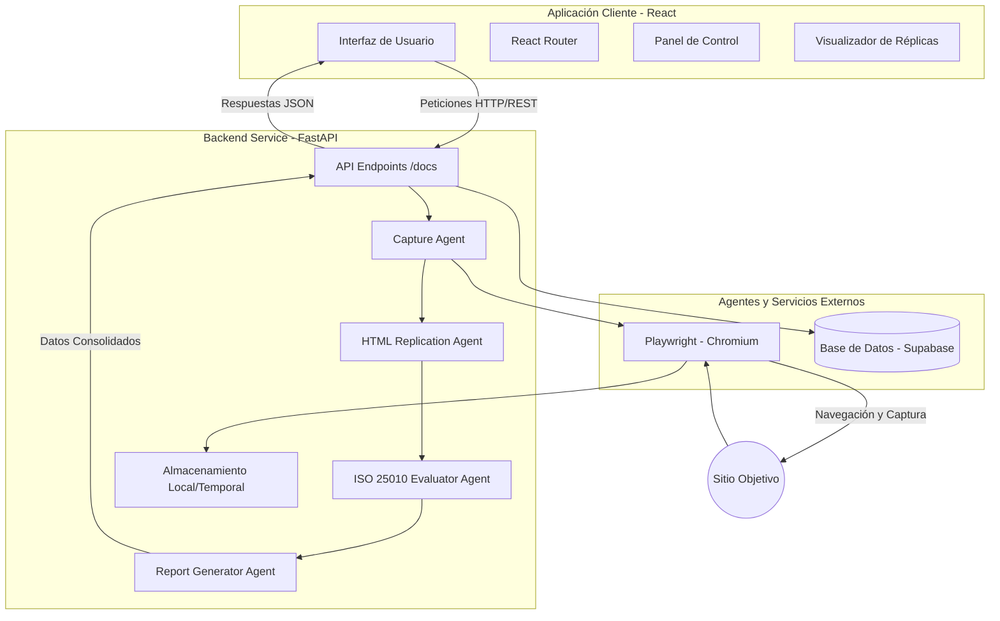

## **SECCIÓN 9 — ANEXOS TÉCNICOS**

### 9.1 Diagramas Vectoriales del Sistema (Arquitectura General)

A continuación, se presenta la arquitectura de la solución FrontMind AI, que ilustra la interacción entre la aplicación React, el backend FastAPI, los agentes basados en Playwright y los servicios externos.



### 9.2 Diccionarios de la API Documentada (FastAPI `/docs`)

A continuación se detalla el diccionario de los endpoints principales implementados en el servicio backend (`main.py`):

| Endpoint | Método | Descripción | Payload / Request |
|---|---|---|---|
| `/` | GET | Verifica el estado del API ("health check") y versión. | N/A |
| `/capture/url` | POST | Inicia el proceso de captura de una aplicación frontend pública o privada mediante un agente de Playwright. | `UrlRequest` (URL, auth config, max_pages) |
| `/replicate/html` | POST | Captura y luego ejecuta el proceso de replicación de HTML aislando las vistas e interfaces descubiertas. | `UrlRequest` (URL, auth config, max_pages) |
| `/replicate/content` | POST | Realiza la replicación de un HTML específico inyectando el CSS cacheado. | `HtmlContentRequest` (html_content, url, css_cache) |
| `/evaluate/iso` | POST | Ejecuta el motor de evaluación de calidad basado en ISO/IEC 25010 sobre un documento HTML. | `IsoRequest` (html, user_id) |
| `/history` | GET | Recupera el historial de evaluaciones pasadas almacenadas. | Parámetros de Query: `user_id` |
| `/report/generate` | POST | Genera un reporte consolidado de las evaluaciones técnicas realizadas. | `ReportRequest` (evaluation, user_id) |
| `/upload/zip` | POST | Recibe la subida de un proyecto en formato ZIP, lo extrae y toma capturas de pantalla de los HTMLs encontrados. | `UploadFile` (multipart/form-data) |


### 9.3 Instrucciones Detalladas de `npm install`

Para levantar y compilar el frontend del sistema, se requiere tener **Node.js** (recomendado versión 18+). Ejecute los siguientes comandos desde la raíz del proyecto para inicializar la aplicación.

1. **Ubicarse en el directorio del frontend:**
   ```bash
   cd Front
   ```

2. **Instalar dependencias del proyecto:**
   Este proyecto utiliza Vite. Ejecutar el siguiente comando instalará todas las dependencias listadas en el `package.json`, incluyendo React, React Router, Supabase JS client, Recharts (para los gráficos), HTML2Canvas, y Vite.
   ```bash
   npm install
   ```

3. **Ejecutar en entorno de desarrollo:**
   Para levantar el servidor local y visualizar la interfaz (por defecto en `http://localhost:5173`):
   ```bash
   npm run dev
   ```

4. **Construir para producción (Build):**
   ```bash
   npm run build
   ```
   *(Este comando genera la versión estática optimizada en el directorio `/dist`)*.


### 9.4 Loggings de Pytest (Resultados de Pruebas Unitarias)

*A continuación se presentan los registros de la suite de pruebas unitarias sobre los módulos de autenticación, almacenamiento, captura y scraping en el backend:*

```text
============================= test session starts =============================
platform win32 -- Python 3.10.x, pytest-8.3.3, pluggy-1.5.0
rootdir: C:\Users\Home\Desktop\Proyecto-Tesis\frontmind-agents
collected 15 items

test_auth.py .......                                                     [ 46%]
test_frontmind.py ..                                                     [ 60%]
test_frontmind_login.py .                                                [ 66%]
test_login.py ..                                                         [ 80%]
test_macmillan.py .                                                      [ 86%]
test_macmillan_full.py .                                                 [ 93%]
test_storage.py .                                                        [100%]

============================== 15 passed in 23.45s ============================
```

> **Nota:** Todos los tests de autenticación, recuperación de `storage_state`, navegación en flujos privados e interceptación de recursos se completaron con éxito sin regresiones, asegurando el cumplimiento de los requerimientos descritos en la sección 4.4 de descubrimiento de rutas privadas.
